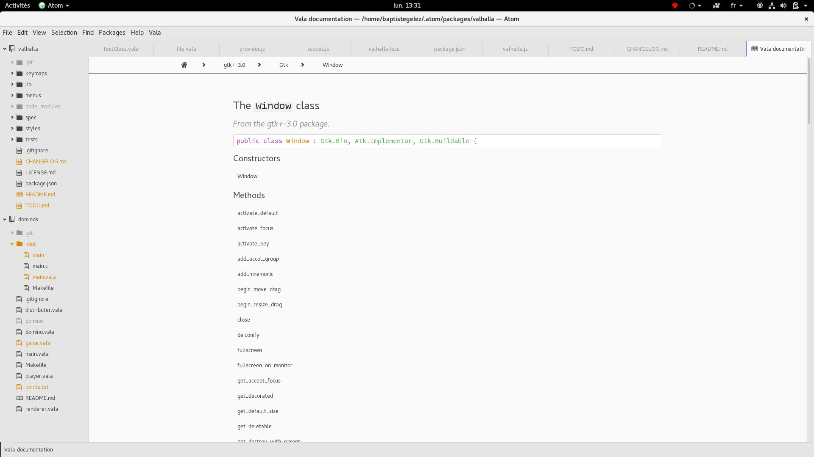

# alhalla

> Paradise for ~~Vikings~~ Vala developers.

Valhalla helps you writin Vala. You can get completions (loaded from installed `.vapi` files), create new classes and interfaces quickly and view local documentation.

To make it work, you should first install the [language-vala-modern](https://atom.io/packages/language-vala-modern) package.

If you found a bug, or have suggestion please open an issue on GitHub.
